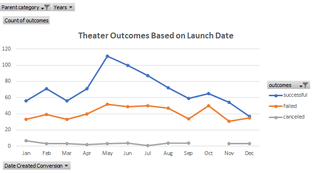
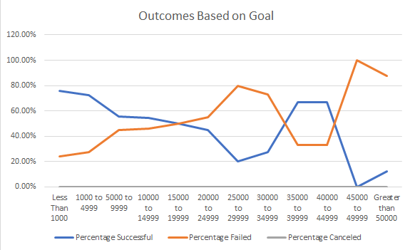
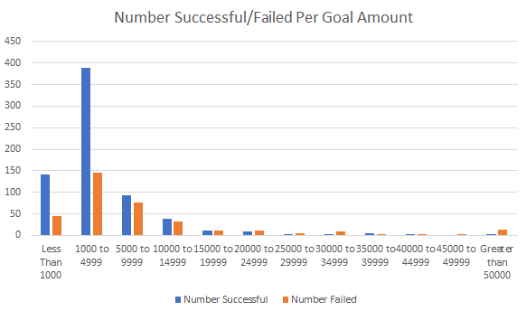

# An Analysis of Kickstarter Campaigns

## Performing Analysis on Kickstarter Data to Uncover Trends

### Purpose of Analysis of Kickstarter Campaign Data

The purpose of this analysis is to help Louise understand if similar plays with similar campaign goals were successful, failed, or were canceled. We can help determine this by reviewing specific campaign goal amounts and also when certain launch dates were throughout the year. By taking into account funding goal amounts, the percentage rate of those successful or failed within a given funding range, and also how launch dates affect performance, we can help Louise make the best decision when setting a funding goal for her campaign.

## Analysis and Challenges

### Analysis of Outcomes Based on Launch Date

### Analysis of Outcomes Based on Goals

### Challenges and Difficulties Encountered

One challenge met was to quantify the number of successful, failed, and canceled campaigns based on goal amounts within certain ranges. To overcome this, I not only used COUNTIFS formulas to help capture how many campaigns met their goals based on how much the funding goal was, I reverified my findings by filtering the raw data accordingly. For example, the number of failed campaigns with the goal amount of less than $1,000, I filtered the raw data on the Kickstarter sheet by first filtering the outcomes (Column F) to Failed, then by the Subcategory (Column O) to Plays, and finally I filtered/selected all the amounts under $1,000 in the Goal column (Column D) - this amount being 45 failed campaigns for plays with a goal less than $1,000.

## Results

- What are two conclusions you can draw about the Outcomes based on Launch Date?

One conclusion I can draw about the Outcomes based on Launch Date are that a significant amount of theater/plays were successful in the months of May and June. Another conclusion that can be made is that theres a small percentage of campaigns canceled each month and even none in October.

- What can you conclude about the Outcomes based on Goals?

I can conclude that a majority of projects that were successful had goal amounts of less than $5,000. 75.81% were successful with goal amounts Less than $1,000 and 72.66% were successful with goal amounts between $1,000 to $4,999.

- What are some limitations of this dataset?

Some limitations to this dataset can be the number of total projects captured within each goal amount. It may be difficult to fully understand how successful campaigns with funding goals of over $10,000 since there were only 158 in this dataset. The number of total projects alone with a funding amount from $1,000 to $4,999 is 534. One thing this does tell us though is that a majority of plays don't have funding goals more than $10,000.

- What are some other possible tables and/or graphs that we could create?

Other possible tables we can use could be based on the amount pledged rather than the goal amount. We could also use pie charts to help visualize the percentages of those successful/failed/canceled. Bar charts may be useful as well to show  the total number of successful or failed campaigns based on their funding goal amount:

